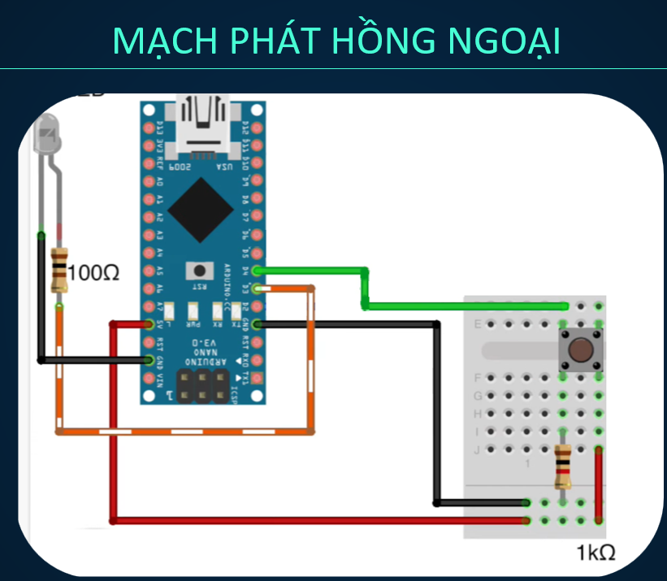

# daikin-ir-control
Điều khiển điều hoà daikin bằng hồng ngoại, arduino nano
# Trước khi lập trình 
Tham khảo daikin protocol từ [rdlab.cdmt](http://rdlab.cdmt.vn/project-2013/daikin-ir-protocol)\
Thu raw data của điều khiển daikin sử dụng esp8266, mạch thu và thư viện IRremoteESP8266\
Thu nhiều lần và tìm được vị trí của dữ liệu nhiệt độ, checksum trong raw data\
# Thiết kế mạch 
### Lưu ý : Tôi chỉ lập trình file daikin_ir.ino, thiết kế và lắp mạch phát tín hiệu do một người khác thực hiện 

# Chắc năng 
Hiện tại code này chỉ có một nút bấm, khi bấm sẽ gửi tín hiệu điều khiển điều hoà và giảm nhiệt độ của điều hoà vào lần ấn tiếp theo
# Tính năng đang phát triển
- Thêm các nút bật,tắt, tăng, giảm nhiệt độ (dã hoàn thành thử nghiệm, chưa publish code)
- Hiện thị nhiệt độ hiện tại của điều hoà ra màn hình LCD
